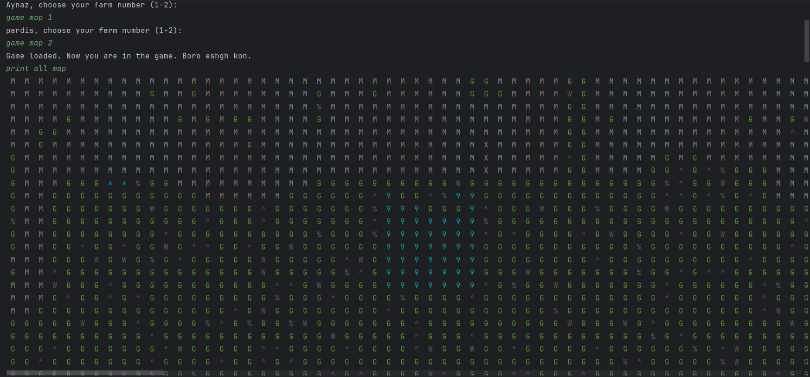
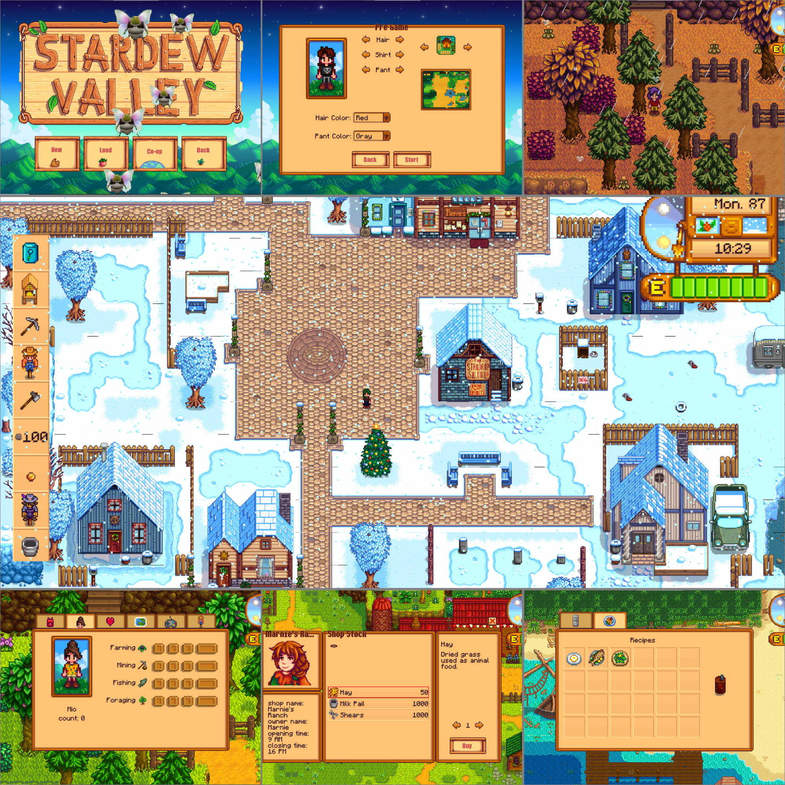

# Stardew Valley (Recreation)

This is my **Advanced Programming (AP)** project.  

This project was created as a **team project ~~3~~(2) members** for the course. It is essentially a **recreation of the Stardew Valley game**, implemented in Java using libGDX.  

A [libGDX](https://libgdx.com/) project generated with [gdx-liftoff](https://github.com/libgdx/gdx-liftoff).  
The project was generated with a template including simple application launchers.

- **`lwjgl3`**: Primary desktop platform using LWJGL3 (was called 'desktop' in older docs).  
- **`Console luncher` (Phase 1)**: A text-based version of the game is also included.

---

## How to Run

### Console Version (Text-Based)
To play the text-based version of the game, run the **console launcher** in your IDE:

```java
ConsoleLauncher.main(); // Run this to start the console game
```



### Graphical Version
To play the graphical version of the game, run the LWJGL3 launcher in your IDE:

```java
Lwjgl3Launcher.main(); // Run this to start the graphical game
```



## Team Members

| Student Number | Name                   |
|----------------|------------------------|
| 403105974      | Aynaz Rahmani          |
| 403106024      | Nafiseh Zarei           |
| ~~403172312~~      | ~~S. Parsa Banihashemi~~   |
